## 1. WHAT THIS IS

Table Aid is a Dungeon Master's screen that lives in one browser tab.

It is a **single HTML file**. There is no installer, no account, no server and no internet
connection involved. You open it, it works. **Save** writes one JSON file to your disk holding
your entire session; **Load** brings it back. Your campaign never leaves your machine, which means
nobody can lose it, sell it, or take it offline.

It assumes you are running **D&D 2024 rules**, that you roll physical dice at the table, and that
the laptop is open in front of you while four people wait. Every decision in it comes from that:
the fight screen is dense because you scan it, the arithmetic is automatic because you shouldn't be
doing it in your head, and the tool never rolls anything unless you press a button that says roll.

There are two ways to fill it in. You can type everything yourself — every tab has an editor and
nothing is locked. Or you can write your adventure as plain text, hand it to Claude with the build
spec, and paste back what it gives you. That second route is covered in §11, including the part
that matters most: **everything Claude invents is marked in red until you say otherwise.**

> **The demonstration file.** *The Miller's Debt* is a complete two-hour oneshot for four
> level-3 characters, built into a copy of the tracker so you can press things without breaking
> anything of your own. Every screenshot in this manual is taken from it.

---

## 2. FIVE MINUTES TO YOUR FIRST FIGHT

If you want to see it working before you build anything, open **the demonstration file** —
*The Miller's Debt*, a complete two-hour oneshot. It opens on a panel explaining what you are looking
at and what to press first.

To start your own from scratch:

1. **⋮ top right** — name the campaign, set party size and level. Everything that calculates
   difficulty reads those two numbers.
2. **Party** — *+ Add character* once per player. Click an HP bar to roll hit points per level.
3. **Bestiary** — *+ New creature* opens a library of 118 templates that rescale to any challenge
   rating. Pick something, set the CR, edit the name.
4. **Encounters** — *+ New encounter*, add creatures from the dropdown, and watch the difficulty
   bar rate the fight against your actual party.
5. **Load into initiative**, and play.
6. **Save** before you close the tab. There is no autosave — see §12.

---

## 3. THE HEADER

Always visible, on every tab.

| Control | What it does |
|---|---|
| **Campaign name** | Set in ⋮ options. The badge under it shows party level and size. |
| **Session clock** | Start, pause, ±5 minute nudges, and **click the readout to type a time**. Accepts `1:23:45`, `2:15` meaning two hours fifteen, or a bare `90` meaning ninety minutes. |
| **Dice** | The floating quick-roller. The **R** key does the same. |
| **↶ Undo** | Steps back through the last twenty actions. Ctrl+Z anywhere. |
| **Save / Load** | One JSON file holds everything. |
| **The pill** | How long since you last saved. Green, then amber at five minutes, then red at fifteen. |
| **Players** | Opens and closes the second window for the other screen (§10). |
| **N to review** | How many things Claude added that you haven't looked at yet (§11). |
| **☾ ☀ ⚙** | Dark, light, or follow the system. |
| **⋮** | Options: name, party, theme, background image, **who rolls the dice**, backups, the review walk, and the paste-a-build box. |

---

## 4. INITIATIVE

The only screen that should be open during a fight. Everything on it is fed by the other tabs.

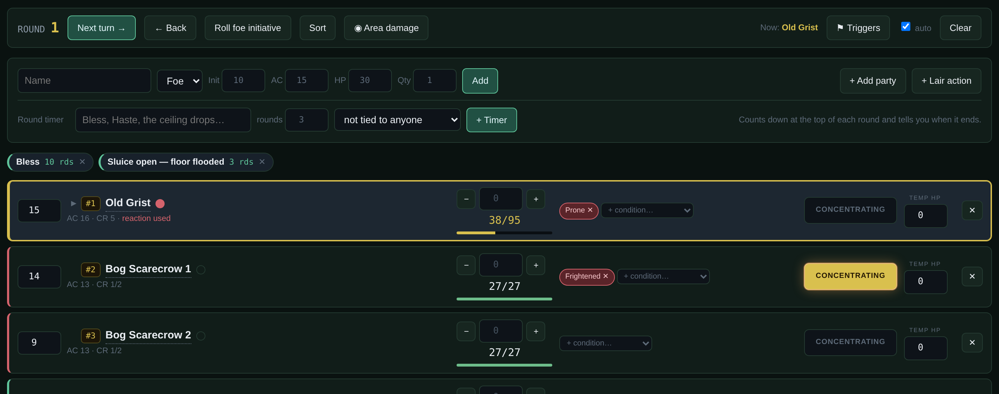

### The row

Each combatant is one row, colour-coded down the left edge: **teal for player characters, green for
allies, red for foes.** The active turn is ringed in amber. Anything at 0 hit points fades out.

- **Initiative** on the left is editable — type over it and press Tab.
- **The name**, with a **▶** in front of it if that creature has spells or limited-use abilities.
- **The meta line** underneath carries everything low-priority as plain text rather than more
  buttons: AC, challenge rating, temporary hit points, legendary counters, spent reaction, and any
  round timer attached to that creature.
- **Damage** goes in the small box between − and +. Type a number and press **Enter** to damage,
  **Shift+Enter** to heal. Focus stays in the box, so you can keep typing.
- **Conditions** are chips. Add one from the dropdown, click a chip to remove it, and **hover any
  chip to read what the condition actually does** and what saves against it.
- **CONCENTRATING** is a toggle, and it is deliberately large, because it is the thing most often
  forgotten.
- **TEMP HP** is separate from hit points and is eaten first by any damage.

### Table numbers

Every foe carries **#1, #2, #3** in the order it entered the fight, in an amber chip beside its name.
This exists because the miniatures on your table are whatever was in the box and rarely match the
stat block. Put the matching numbered die next to each model and the screen tells you which is which.

Click the number to change it. **Numbers are never recycled** when something dies or is removed —
the die on the table doesn't move, so neither does the number. Loading a fresh encounter starts
again at 1, because all the foes are replaced.

### The reaction dot

The small circle beside each name. Click it when that creature spends its reaction; it turns red and
the meta line says so. It **clears itself automatically at the start of that creature's next turn**,
which is exactly when a reaction comes back.

### Round timers

Type a name and a number of rounds into the bar above the list. The timer appears as a chip,
**counts down at the top of each round**, and announces itself the round it ends. Tie it to a
creature and it also shows on that creature's row. Use it for Bless, Haste, a burning building, or
anything with a clock on it.

### Area damage

**◉ Area damage**, or the **A** key. One pass over every combatant: tick who is in the blast, mark
each as *failed / saved / no effect*, type the damage once, and it applies full, half or nothing to
each, eats temporary hit points first, and **queues a concentration check for every concentrating
creature that took damage** so they arrive one at a time instead of being forgotten.

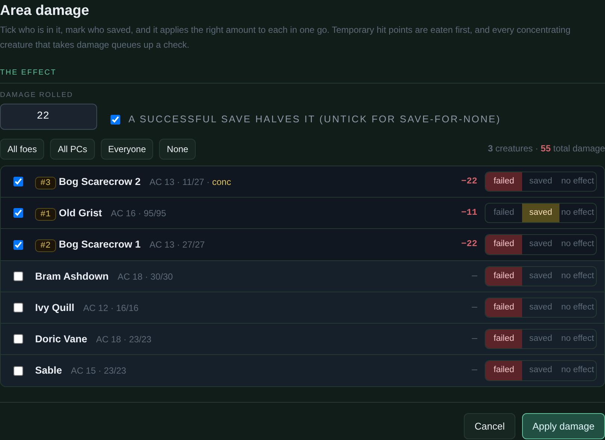

### Concentration

When a creature flagged CONCENTRATING takes damage, a check opens by itself. It shows the damage,
the DC — `max(10, damage ÷ 2)` — and what you need to roll. It says **roll a die**, you roll your own
and type the number, and it adds that creature's stored Constitution save and tells you whether
concentration holds. Dropping to 0 hit points ends it with no save, automatically.

If your table would rather the screen rolled, turn on **⋮ → Dice → let the tracker roll the dice** and
a **Roll d20** button appears beside the box. See §9.

### Automatic triggers

Things that fire at a fixed moment — regeneration, an aura that applies before initiative, a
recharge, "they're already singing when the party walks in" — pop up at the right time rather than
depending on your memory.

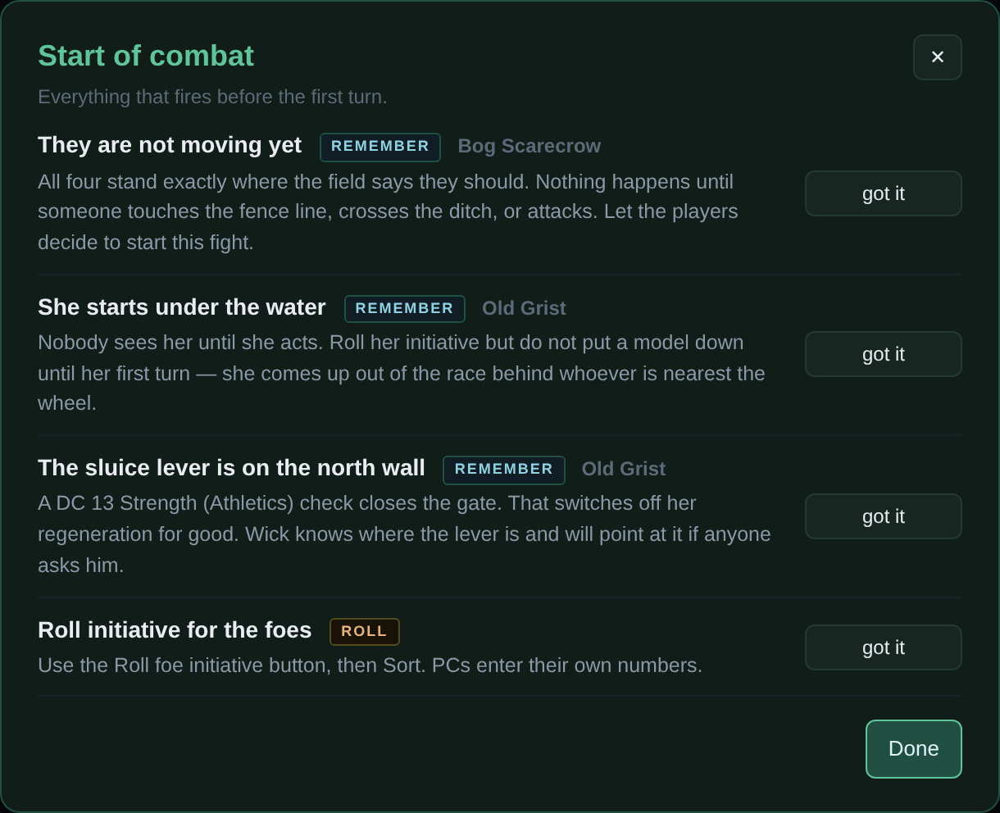

Start-of-combat triggers fire when an encounter loads. Start-of-turn triggers fire on that
creature's turn, and anything with a healing amount attached gets an **Apply** button. The **auto**
tick in the bar turns the automatic popping off; **⚑ Triggers** shows the current turn's on demand.

### Lair actions

**+ Lair action** drops a slim row into the order at initiative 20 with a text field. Type what the
lair does and it comes round at the right point every round like anything else.

### The tray

The **▶** in front of a name opens that creature's spells and abilities, in a fixed order:

1. **Spell slots** as pips — click to spend, click a spent one to give it back.
2. **Spells**, each with its level, casting time, a one-line effect, and a **cast** button that
   spends the slot and tells you how many are left.
3. **Legendary resistances and legendary actions** as pips, with a **refill** button and that
   creature's legendary action menu written out underneath. Legendary actions refill automatically
   at the top of each round.
4. **Limited uses** — anything finite, including recharge abilities with a **roll d6** button.

---

## 5. PARTY

One card per player character. This is not a character sheet; it is the six things that change
during a session and that you, not the player, tend to be asked about.

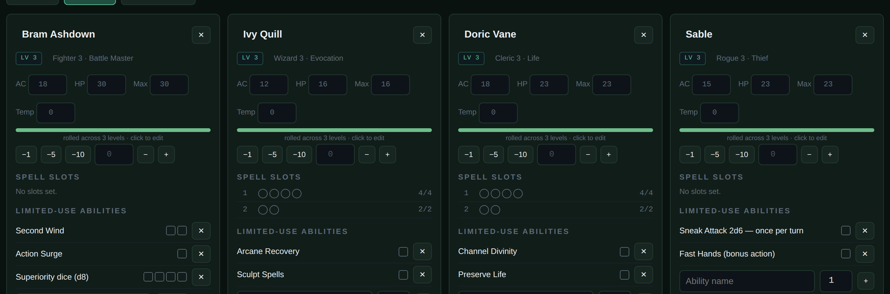

Hit points with temporary hit points, spell slots as clickable pips, class features with uses,
conditions, and death saves. **Short rest** clears per-rest features; **long rest** clears
everything and restores hit points.

### The hit point roller

Click any HP bar. This table rolls hit points per level, so the roller does it properly.

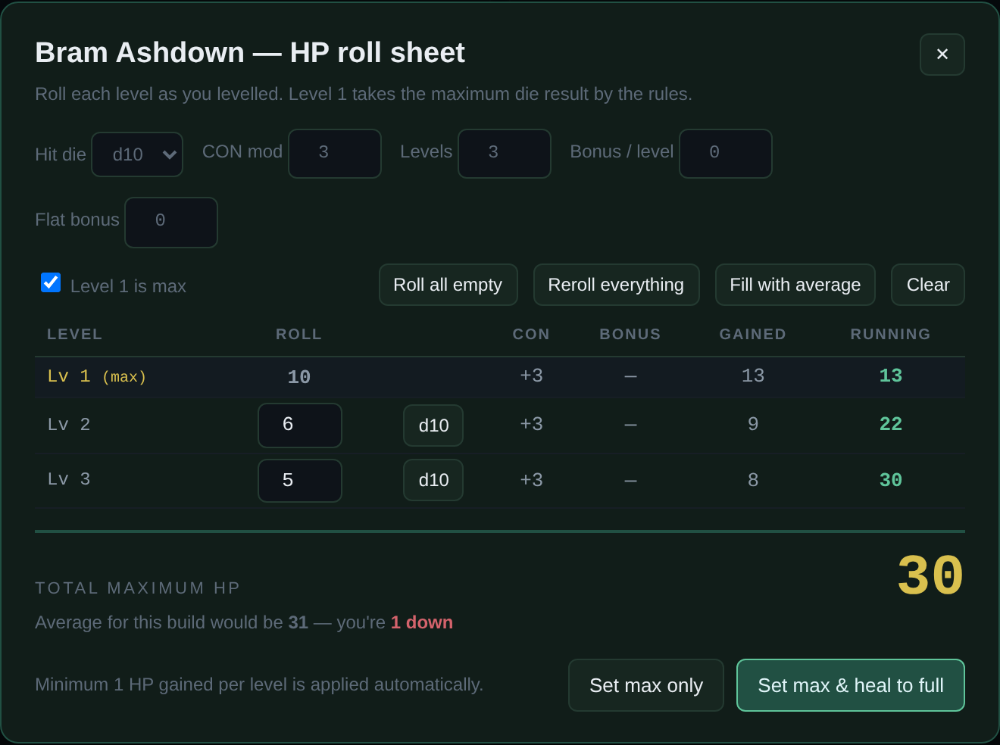

One row per level, level 1 taking the maximum die by default, a per-row roll button, and bulk
actions — roll all empty, reroll everything, take the average, clear. Set the hit die and the
Constitution modifier at the top, and add a per-level bonus if a feat is giving you one. It applies
the **minimum 1 hit point per level** rule, keeps a running total, and tells you how far above or
below the average build you landed. The number of filled rows sets the character's level, which is
shown on the card.

---

## 6. BESTIARY

Every creature in the campaign. **Foes get red cards, allies and NPCs get green ones**, and the
tracker treats the two differently everywhere — including on the battle maps and in area damage.

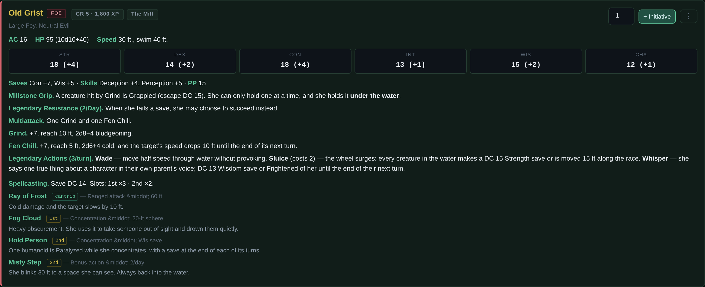

Filter by name or group, or narrow to just foes or just allies. **+ Initiative** on any card drops
it straight into the fight. The **⋯** menu on every card gives Edit, Duplicate, Move up, Move down
and Delete — and Delete always asks twice.

### The template library

**+ New creature** opens **118 templates in 15 categories** — rabble, soldiers, monsters, beasts,
undead, dragons, giants, fiends, fey and celestials, aberrations, elementals and constructs, oozes
and plants, casters, leaders and allies.

Pick a target challenge rating and the template is **rebuilt against it**: armour class, hit points,
hit dice, attack bonus, save DC and damage all rescale, and bigger creatures gain extra attacks so
the dice stay readable rather than turning into `19d8`. **Hover a card to read the finished block
before you commit to it.**

Each template also carries the **CR band where it still reads as itself**. Push a kobold to CR 20 or
a dragon down to CR 2 and it will tell you that you have left the archetype rather than silently
obeying. Nothing is prevented; you are simply told.

Every field in the editor has a **⋮ library** button beside it that opens a picker of
common entries — 44 traits, 76 spells, standard uses and triggers — with a syntax guide for
that specific field. Clicking one appends it rather than replacing what you have already written.

---

## 7. ENCOUNTERS

A preset fight that loads into initiative in one click, rated live against your actual party.

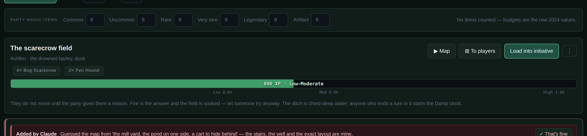

### How the difficulty is worked out

The 2024 Dungeon Master's Guide gives an XP budget **per character** at each level. The tracker
multiplies that by your party size. **There is no encounter multiplier in the 2024 rules** — the
number of monsters does not inflate the budget the way it did in 2014.

For four characters at level 3, that is **Low 600 · Moderate 900 · High 1,600 XP**.

These budgets are tighter than the 2014 ones, so fights that felt "medium" under the old maths often
rate above High here. That is the new table, not a fault in the tool.

The bar takes **the colour of the band the fight lands in** — blue below Low, green at Moderate,
amber, and red at High and above — so you read the band at a glance rather than measuring a position.

**Magic items widen the budget.** There is no official rule converting gear into encounter XP, so
this is homebrew and it is editable: each item adds a percentage to every threshold (common 2%,
uncommon 5%, rare 10%, very rare 18%, legendary 30%, artifact 50%), capped at +200%. Count your
party's items in the row above the encounters, or set every percentage to zero in ⋮ options to
switch the feature off entirely.

**XP is entered per creature, not per encounter.** Put the single-creature value on the stat block
and set the quantity in the fight.

### Battle maps

Every encounter can carry a schematic map on a 5-foot grid, with a scale line and a note on how to
draw it on your own mat.

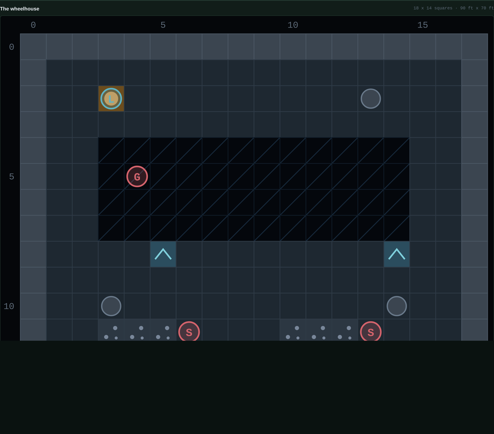

Maps are written as a text grid in the encounter editor — one character per square. The tile
language is in Appendix A. **Every row must be the same length**; short rows get padded with floor.
Tokens are placed by coordinate and carry a letter, a side and a label.

**⧉ To players** puts the map on the second screen (§10).

---

## 8. STORY

The running order, and the tab you actually read from during the session.

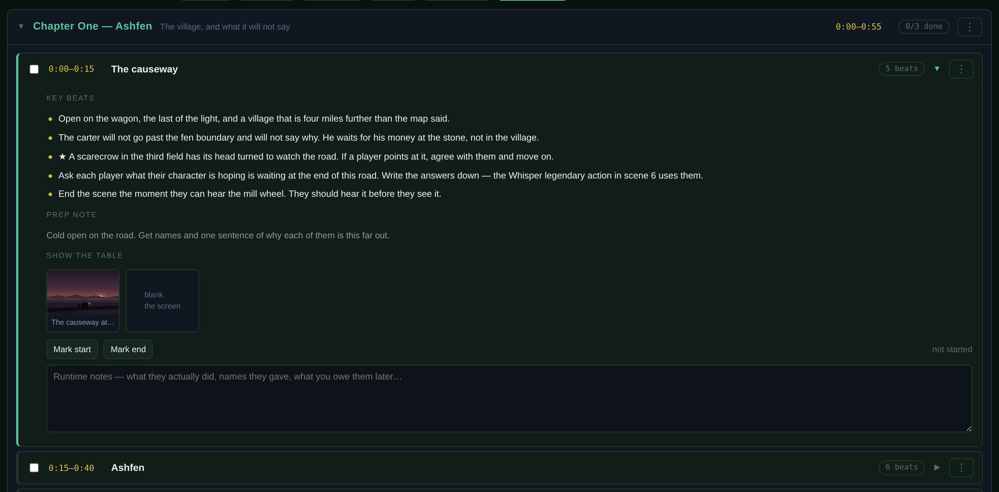

### Chapters

Segments live inside chapters, so a long campaign can fold away everything it has already played.
A oneshot needs one chapter. A campaign gets one per session, or one per act.

Click a chapter header to fold it. **Fold finished** collapses every chapter you have fully ticked
off. The **⋮** on a chapter renames, duplicates, reorders or deletes it — and deleting a chapter
moves its segments into the neighbouring one rather than throwing them away. Move a segment up or
down past a chapter boundary and it changes chapter.

### Key beats

The bullets at the top of an open segment. **This is the most valuable thing in the file.** They are
what you read in three seconds while four people look at you: what happens, who they talk to, the
decision they face, the line you have to remember to say, the thing you are planting now that pays
off in two hours. Lead the pivotal ones with ★. The segment header shows a beat count, so you can
see at a glance which scenes you have actually prepped.

Under them sits the **prep note** — the one line you need in your hand — and under that, a
**runtime notes** box you type into during play. That box is saved with everything else, and it is
what the recap export reads.

### Images

Open a segment's editor and there is an *Images for the players' screen* section. Paste links or
upload files, name them, reorder them. They appear as thumbnails under **Show the table** in the
open segment, and one click throws one onto the player window. There is a *blank the screen* tile
next to them for when you want their eyes back on you.

Uploaded images are downscaled to 1600px and stored inside the save file. A handful per scene is
fine; forty across a session will make the JSON large. Links cost nothing but need the machine
online when you show them.

### The fight in this segment

A segment can carry an encounter. Pick one in the segment editor and a **⚔ Run** button appears on
the segment, so you start the fight from the story rather than switching tabs and hunting for it.

### The clock and the pacing readout

Start the session clock in the header and the Story tab tells you **which segment you should be in
right now** and how many you are ahead or behind. **Mark start** and **Mark end** stamp what a scene
actually took, which is how you find out that your forty-minute dungeon is a ninety-minute dungeon.

### ⇩ Story PDF

Prints the whole adventure as a document you can read away from the screen: every chapter, every
segment with its beats and prep note, the fight that belongs to each, then the handouts with their
solutions, the campaign mechanics, and every stat block. Anything still marked as added by Claude is
flagged in red in the text.

It uses your browser's own print dialog, so pick the PDF destination rather than a printer —
**Save as PDF** in Chrome and Edge, **Save to PDF** in Firefox. This is the single most useful thing
to have in front of you the day before a session, and it is also the easiest thing to mark up when
you want changes made (§14).

### ⇩ Recap

Writes the session out as a markdown file: chapters, segments, what time each actually ran, the
notes you typed during play, and where the party ended. This is the thing to paste into your
session log.

---

## 9. TOOLS

Three things live here: a dice roller, your campaign's homebrew rules, and the handouts you put in
front of the table.

### Who rolls

This table rolls its own dice, so out of the box **the tracker never rolls anything you did not ask it
to.** Every check — concentration, a campaign mechanic, a random table — says **roll a die** and gives
you a box to type the number into. It does the arithmetic from there and tells you the result.

Some tables would rather the screen did it. **⋮ → Dice → let the tracker roll the dice** puts a
**Roll** button beside every one of those boxes instead. Two things ignore the setting entirely,
because they are dice tools rather than checks: the two **dice rollers**, and **Roll foe initiative**,
which is always there.

### The dice roller

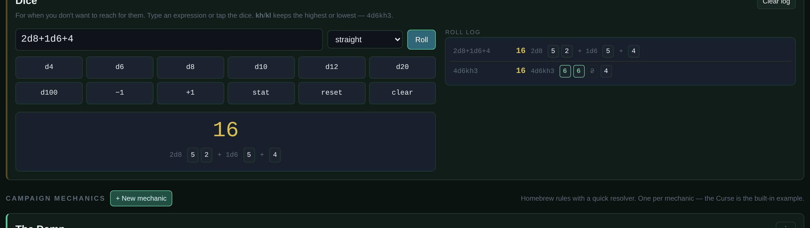

Type an expression: `1d20+5`, `2d8+1d6+4`, `4d6kh3`. **kh** and **kl** keep the highest or lowest
N dice. The die buttons build the expression for you and **+1** / **−1** nudge the modifier.

The **advantage / disadvantage** selector rolls the whole expression twice and keeps the better or
worse total — and shows you the one it dropped, so you can see how close it was.

Every die is shown individually: maximum faces go green, natural 1s on a d20 go red, and dice
dropped by `kh` or `kl` are struck through. The log keeps the last sixteen rolls, which means "what
did I actually roll for that" has an answer.

### Campaign mechanics

The homebrew rule that makes your campaign yours — a curse, a madness track, corruption, heat,
supply, a doom clock. Anything with tiers and a saving throw becomes:

- a one-line statement of the rule in a coloured callout,
- a **quick resolver** where you enter the situation and it prints the DC, how many saves, and what
  success and failure do, with a button to roll it,
- the full rules table,
- an optional random table with its own roll button,
- and free-text panels for the legitimate ways to cheat the rule.

You can have as many as you like. If your campaign has no such rule, leave the section empty.

### Handouts and puzzles

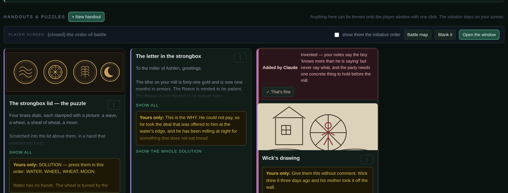

Each handout has a **player-facing side** — an image, some text, or both — and a **solution that
never leaves your screen**. Write the riddle in the top half and the answer, the DCs and the
consequences in the bottom half, and you can put the puzzle in front of the table while reading how
it works off your own laptop. Long solutions expand in place; click *show the whole solution*.

**Show to players** throws it onto the second screen. The card turns green while it is up there.

---

## 10. THE PLAYERS' SCREEN

**Players** in the header opens a second browser window to drag onto your other monitor. Press it
again to close it. Nothing about the main tracker changes whether it is open or not, so if you only
have one screen you can ignore this entire section.

It shows exactly one thing at a time, and you choose which.


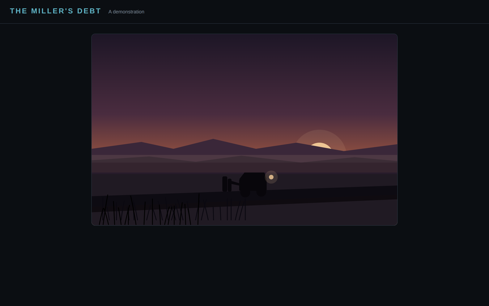

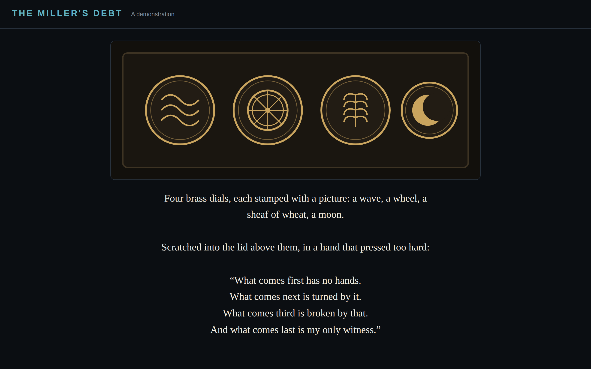

**The initiative order is hidden from them by default.** There is a *show them the initiative order*
tick in the Player screen bar at the top of the handouts section. Left off, they see the map and
nothing else. Turned on, they see names, table numbers, conditions and whose turn it is — and
**never hit points, armour class or stat blocks**, whatever you do.

The fastest route mid-session is **Ctrl+K**: type a handout or image name, press Enter, and it is on
their screen.

If nothing happens when you press Players, your browser has blocked the pop-up. Allow pop-ups for
the page and press it again.

---

## 11. SETTING CLAUDE UP — ONCE

You need a place to keep the files so you are not attaching them again every time. On claude.ai that
is a **Project**: a folder with its own instructions and its own documents, shared by every chat
inside it.

### Making it

1. Go to **claude.ai**, and in the left sidebar press **Projects → Create project**.
2. Name it something like **D&D — Table Aid**. The description can be one line: *turning my adventure
   notes into a Table Aid tracker.*
3. Open the project and find **Project knowledge** (on some layouts it is called *Add content* or a
   paperclip). This is the folder everything goes in.

### What goes in the project knowledge

| File | Why it lives here | Required |
|---|---|---|
| `02_BUILD_SPEC.md` | The contract. Every field the tracker understands and the rules about what Claude may and may not touch. **This is the one that does the work.** | **Yes** |
| `01_AUTHORING_GUIDE.md` | What the tool actually does, so Claude answers your questions about it correctly | Recommended |
| `03_ADVENTURE_TEMPLATE.md` | The fill-in form, if you would rather write into headings than face a blank page | Optional |
| `05_DEMO_SOURCE_NOTES.md` | A worked example of good notes. Useful for Claude to see the standard you are aiming at | Optional |
| **Your adventure** | Add it as a document once it is written, or just paste it into the chat | Either |

Do **not** put the tracker's `.html` file in the project. It is a quarter of a megabyte of code that
Claude never needs to read — the build travels as a small block of JSON instead.

### Project instructions — do not skip this

Open **Project instructions** (or *Custom instructions*) and paste the block below.

It is not just a convenience. Project instructions are **always in front of Claude**, whatever else
is going on, whereas a document in the project can end up being searched rather than read (see *When
projects get full*, below). So the rules that must never be missed live here, and the field-by-field
detail lives in the spec, where being read in pieces is survivable.

```
When I ask you to build or update a Table Aid tracker:

1. Read 02_BUILD_SPEC.md in full first. If you cannot see it, say so and stop.
2. KEEP MY WORDS. Anything I wrote goes in exactly as I wrote it — don't tidy,
   rename, reorder or improve it.
3. MARK EVERYTHING YOU ADD. Every creature, encounter, segment, mechanic and
   handout you invent, stat, scale, balance or guess at gets:
       "ai": true, "aiOk": false,
       "aiNote": "<one sentence: what you did and why>"
   Anything from my own text carries no mark. Unmarked invention is the worst
   outcome; marking my own writing is the second worst.
4. Return ONE fenced json block containing {"tableAidBuild":1,"data":{...}}
   and nothing else inside it. Questions and reasoning go outside it.
5. Ask me about anything where guessing wrong changes my story — the ending,
   who the villain is, whether a fight is winnable. Build everything else.

My table: 4 players, D&D 2024 rules. I roll physical dice.
```

Change the last line to match your table. That is the whole setup, and you only do it once.

### When projects get full

Claude reads everything in a project's knowledge directly — until the project gets big. At that
point it switches automatically to **searching** the documents instead of reading them whole, and
**you cannot turn that off**.

For a reference document that is fine. For a *contract* like the build spec it is not: Claude may
pull the parts about field names and miss the parts about provenance, and nothing will look wrong.

The authoring pack is small — about eleven thousand tokens all together — so it will never trigger
this on its own. What triggers it is everything else you put beside it. So:

- **Keep this project for Table Aid only.** Campaign bibles, session logs, module PDFs and rules
  references go in a *different* project. They will make your builds worse here, not better.
- **If you suspect the spec didn't land**, ask before you build:
  *"Before you build anything — what are the three provenance fields, and what does each one mean?"*
  If the answer isn't `ai`, `aiOk` and `aiNote`, paste the spec straight into the chat and carry on.

> **The skill instead.** If you would rather not manage a project at all, `table-aid.skill` is the
> same contract packaged as a Claude skill. Install it once in your account and say *"build this into
> a Table Aid tracker"* in any chat, with nothing attached.

---

## 12. FROM YOUR NOTES TO THE TRACKER

Start a new chat inside the project, paste the prompt, paste your adventure underneath.

### The short version of the prompt

```
Build my adventure into a Table Aid tracker, following 02_BUILD_SPEC.md.

My party: 4 players, level 3, D&D 2024, no magic items
Session length: about 2 hours
Tone: damp English folk horror, warm rather than grim

My adventure follows.
```

Claude returns one fenced block of JSON. Copy it, then in the tracker:
**⋮ top right → Paste a build from Claude**, and choose **Replace everything** or **Merge into what
I have.** Merging keeps your campaign and folds the new material in; a creature whose name you
already have is kept as yours rather than overwritten.

### How much you write is how much you get

This is the part worth understanding before you start, because it changes what comes back more than
anything else you can do.

**The two-sentence brief.** Somebody writes: *"A haunted watermill. Four players, level 3, about two
hours. There's a hag."* Claude can build a running tracker from that — but every single thing in it
is a guess, and it says so:

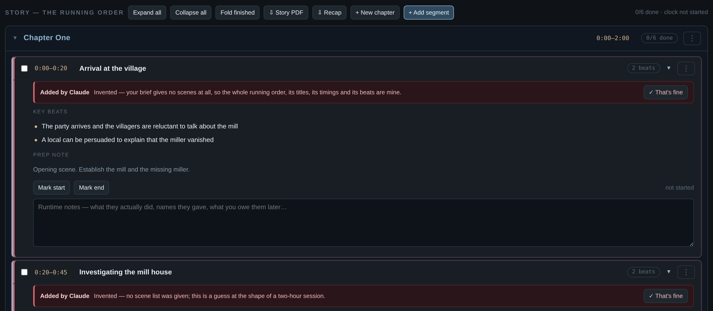

**The same adventure, written properly.** A page of notes — seven scenes with rough times, four
creatures with numbers, a homebrew rule, a puzzle with its answer, and an honest list of what the
author hadn't decided. Same tool, same prompt:

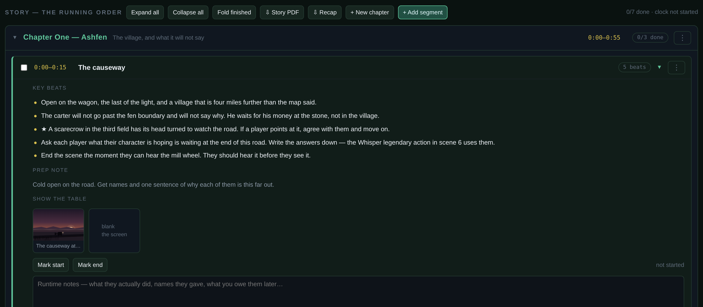

| | Two sentences | A page of notes |
|---|---|---|
| Items in the build | 11 | 24 |
| Marked as invented | **11 of 11** | **4 of 24** |
| Creatures | 3, all invented | 6, one invented |
| Scene beats | all invented | all the author's |
| The ending | a placeholder | the author's |
| Puzzle with a solution | none | one, with three tiers of hint |
| Time to review | the whole file | about four minutes |

The point is not that the thin build is bad. It runs, it is balanced, and for a pick-up game on a
Tuesday it is genuinely enough. The point is that **you cannot tell which parts are yours, because
none of them are** — and a session made entirely of a model's guesses is a session where nothing
surprises you either.

**What is worth writing down, in order of how much it buys you:**

1. **What actually happens in each scene.** Three fragments per scene beats three paragraphs of
   prose. This is the single highest-value thing you can write.
2. **How your fights are meant to be won.** "The grate drains the room and stops its regeneration" is
   the difference between a fight and a slog.
3. **Constitution saves** on anything that concentrates.
4. **Your ending.** Claude will write you one, and it will be competent, and it will not be yours.
5. **What you haven't decided.** List it. Claude asks about those instead of quietly inventing them,
   which is exactly the trade you want.

---

## 13. CHECKING CLAUDE'S WORK

Every creature, encounter, segment, mechanic and handout that **Claude invented** carries a red rail,
a one-sentence note saying what it did and why, and a **✓ That's fine** button. Everything **you**
wrote renders plain.

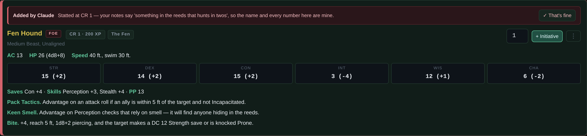

### The review walk

The header pill says how many are still unreviewed. **Click it and it takes you to the next one** —
switching tab, opening the right chapter, scrolling to the card and highlighting it. Click again for
the one after that. You never have to hunt.

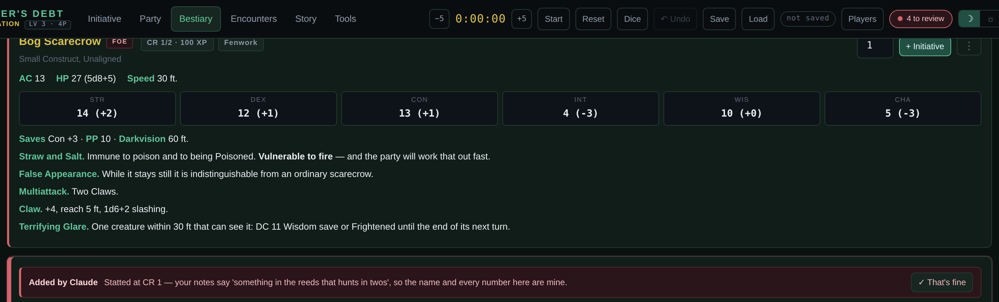

Read the note, and then either press **✓ That's fine**, or make the change yourself, or write it down
for the next round (§14). In the demonstration file, all four take about four minutes.

**⋮ → What Claude added** has the same walk as a button, plus *Accept everything*, *Flag it all
again*, and a switch that hides every mark at once. Turn it off and you have a clean tracker; turn it
back on any time, even mid-session.

The notes are meant to be argued with. *"Statted at CR 5 — you named them and said 'tough but not
elite', so every number here is mine"* is an invitation to change the numbers, not a disclaimer.

---

## 14. ASKING FOR CHANGES

You will not like everything. That is the expected outcome, not a failure — and there are three ways
to say so, in ascending order of effort.

### 1. Just tell it

Go back to the same chat and say what is wrong in plain words. The adventure is still in the
conversation, so you do not need to re-explain anything:

```
The Fen Hound isn't right — they should be birds, not dogs, and they should
grapple and lift rather than knock down. Rebuild that creature and both fights
it appears in, and give me the whole data object back with the marks intact.
```

Always ask for **the whole `data` object back**, and paste it in with **Replace everything**. Asking
for a fragment gets you a fragment you then have to splice by hand.

### 2. Mark up the story

**Story → ⇩ Story PDF** gives you the whole adventure as a document. Read it on a train, on paper,
anywhere that is not the tab you built it in — you will spot things you never noticed on screen.
Then tell Claude which bits to change.

### 3. Mark it up in Word

Ask for the review copy:

```
Give me the story as a Word document with a comment on everything you invented,
so I can mark it up and hand it back.
```

You get a `.docx` where each invented passage carries a comment explaining itself, anchored to the
exact text:

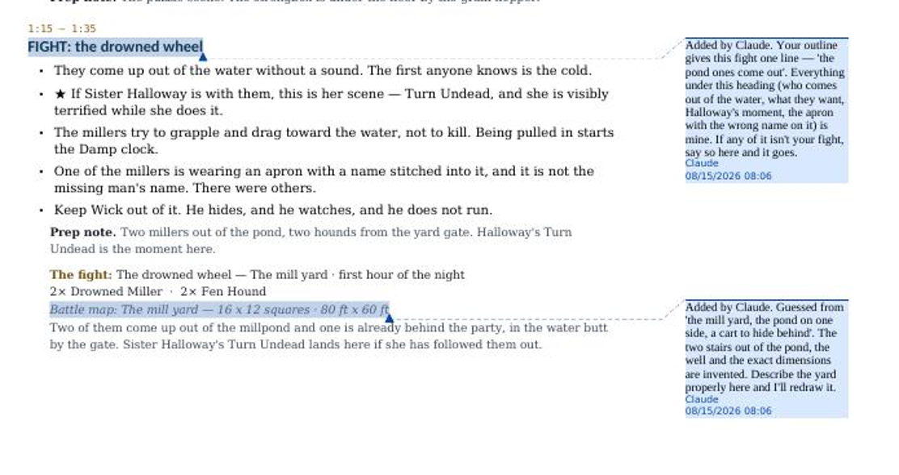

Reply to the comments with what you actually want. Or turn on **Review → Track Changes** and rewrite
the text directly, striking out anything that should go. Or highlight a paragraph and type WRONG next
to it — precision is not required.

Then hand the file back:

```
I've marked up the story — apply my comments and give me an updated build.
```

You get a fresh JSON block with your changes made, the marks cleared on anything you accepted, and
new marks on anything your change forced Claude to invent in turn. Paste it in with **Replace
everything** and the tracker is up to date.

> **Save first.** *Replace everything* replaces your whole campaign. The pill beside **Load** tells
> you how long it has been since you saved, and **Ctrl+Z** will undo the paste if you forget.

---

## 15. SAVING, UNDO AND BACKUPS

There is **no autosave**. Browser storage is not available to a file opened this way, and pretending
otherwise would be worse than saying so.

- **Save** downloads one JSON holding every tab, your runtime notes, the scene stamps and the clock.
  Keep it next to the HTML file, or in whatever cloud drive you already use.
- **The pill** beside Load tells you how long it has been. It goes amber at five minutes and red at
  fifteen, and the browser will stop you closing the tab with unsaved changes.
- **Undo** — Ctrl+Z, the header button, or the Undo that appears on the toast right after anything
  destructive. Twenty steps deep, covering deletes, clears, damage, rests, loads and merges. It does
  not undo typing in a notes box, and it never rolls back the session clock.
- **Automatic backups** are off by default. Turn them on in **⋮ → Not losing your evening** and it
  writes a timestamped JSON to your downloads every 10, 15 or 30 minutes. The first one makes the
  browser ask whether to allow multiple downloads; say yes once and it stops asking.

---

## 16. KEYBOARD

| Key | What it does |
|---|---|
| **Space** | Next turn |
| **R** | Open the quick dice roller with a d20 loaded |
| **A** | Area damage |
| **P** | Open or close the player window |
| **Ctrl+K** | Jump to anything — creatures, fights, segments, mechanics, conditions, spells, anyone in the current initiative order, handouts and scene images |
| **Ctrl+Z** | Undo |
| **Click the review pill** | Jump to the next thing Claude added that you have not signed off |
| **Enter** in a damage box | Damage |
| **Shift+Enter** in a damage box | Heal |
| **Esc** | Close whatever is open |

---

## 17. THINGS THAT WILL BITE YOU

- **Save before you close the tab.** It is the only thing standing between you and a lost evening.
- **Pasting a build with *Replace everything* replaces the whole campaign.** Save first, or use
  *Merge*.
- **Map rows must all be the same length**, or the grid will look wrong.
- **Every creature needs a Constitution save value**, or its concentration checks default to +0.
- **XP is per creature, not per encounter.**
- **The app assumes a laptop.** It works on a tablet in landscape. It is not a phone tool.
  Ctrl+scroll zooms if you are reading it from across the table.
- **The player window is a pop-up**, and **Firefox blocks pop-ups by default**. The first time you
  press **Players** you may get a bar across the top of the page instead of a window: allow pop-ups
  for the page and press it again.
- **Uploaded images live inside the save file.** A handful is fine. Forty is a large JSON.
- **Ask for the whole `data` object** when you request changes, not a fragment.
- **Don't let the Claude project fill up.** Keep it to the authoring pack and your current adventure;
  once a project outgrows the context window, Claude searches its documents instead of reading them,
  and the build spec is the wrong kind of document to read in fragments.
- **The Story PDF uses your browser's print dialog.** Pick the PDF destination, not a printer —
  *Save as PDF* in Chrome and Edge, *Save to PDF* in Firefox.

---

## APPENDIX A — MAP TILES

One character per 5-foot square, in the encounter editor's grid box.

| Character | Square |
|---|---|
| `#` | rock or wall |
| `.` | floor |
| `~` | open air, water, or a fall |
| `^` | rubble — difficult terrain |
| `s` | stair or ramp |
| `=` | ledge edge |
| `o` | pillar or post |
| `T` | plinth |
| `C` | chimney going up |
| `X` | crack going down |
| `D` | door |

Tokens are one per line: `x | y | letter | side | name`, where `x` and `y` count from zero at the
top left and `side` is `foe`, `ally` or `pc`. Keep maps to roughly 20 × 14 squares; larger ones stop
being copyable onto a mat.

---

## APPENDIX B — EDITOR SYNTAX

Every one of these fields has a **⋮ library** button beside it with common entries to
click in and a fuller explanation.

| Field | Format |
|---|---|
| **Traits and actions** | One per line. Plain HTML is allowed; wrap the label in `<b>…</b>`. |
| **Spells** | `name \| level \| perDay \| casting note \| effect` — level 0 is a cantrip, and a number in perDay makes it innate instead of spending a slot. |
| **Limited uses** | `name \| max \| recharge \| note` |
| **Triggers** | `name \| kind \| healAmount \| text`, where kind is `auto` (gets an Apply button), `roll`, or `rem` for a reminder. |
| **Mechanic table** | Pipe-separated, headers on the first line. Then tell it which column holds the DC. |
| **Key beats** | One per line. |
| **Times** | `h:mm` from the start of the session. |

---

*Table Aid is an unofficial fan tool with no affiliation to Wizards of the Coast. It reproduces no
official stat blocks, spell text or rules text — everything in it is written fresh and mechanically
equivalent. Bring your own Player's Handbook.*
